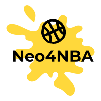

<p align="center">
  
</p>

## About
**Neo4NBA** is a neo4j graph db of the NBA basketball league over the past decade (2010-20).

The graph contains data about:

-	Teams and divisions
-	All players played
- Yearly rosters
-	Coaches
-	Player regular season stats
-	Draft picks (and undrafteds)
- Pre draft teams (e.g college, high-school, euroleague)
-	Personal awards (MVP, MIP etc.)
-	Playoff series
-	Players nicknames
- Regular season/ playoff games (including date and score)

## Requirements
### General
Python 3.7.0 (https://www.python.org/downloads/)

Local neo4j server 3.5.14 (https://neo4j.com/download-center/#community)

### Packages
neo4j 1.7.0

Use the package manager [pip](https://pip.pypa.io/en/stable/) to install neo4j package

```bash
pip install neo4j
```

## Setup
### config.py
In the config file you will need to enter your neo4j server credentials and bolt address
```python
NEO4J_USERNAME = "username"
NEO4J_PASSWORD = "passwrod"
NEO4J_BOLT_ADDRESS = "bolt_address"
```

The graph is based on static csv files that are located in the 'graph_files' folder.
In order to copy them into your local server you will need to enter your server import directory path
the and set the *should_copy* flag *True*

```python
NEO4J_IMPORT_DIRECTORY = "import_dir_path"
SHOULD_COPY_FILES_TO_SERVER = True
```
### APOC library
The neo4j query language (cypher) supports a user-defined procedures and functions library called 'apoc', 
which is used by some of the graph updaters.

In order for them to work you will need to move the attached 'apoc.jar' file into your local neo4j server 'plugins' folder
### Neo4j browser style
Drag the attached 'style.grass' file to your neo4j browser and release for a more visual and clear graph
### DB dump file (optional)
For those of you that already familiar with neo4j, you can skip the graph update by the overlay method (one by one),
and load directly the attached 'neo4nba.dump' file into your neo4j server

Thats it! Your'e good to go.

## To Be Added

- NBA2K game ratings
- Hall of Famers
- All-Star weekends

## Resources
https://www.basketball-reference.com/
https://www.kaggle.com/pmp5kh/nba-draft-19802017
https://hoopshype.com/2019/02/24/all-the-nicknames-in-nba-history/
https://data.world/datasets/nba
